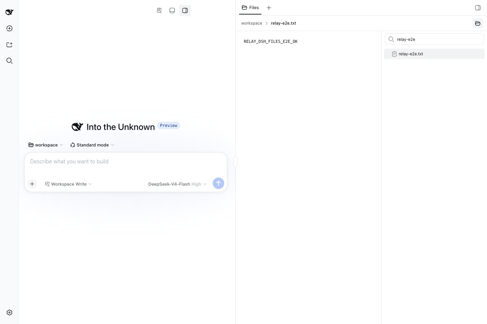

# Relay DSH Workbench Plugin

> Unreleased adaptation: this branch targets DSH `0.1.2-alpha.2`. npm versions and tags are unchanged; installation examples for published releases do not establish compatibility with the new DSH. See [compatibility notes](docs/dsh-0.1.2-alpha.2.md).

[](https://www.npmjs.com/package/relay-dsh-plugin-workbench)
[](https://github.com/yangbobo2021/relay-dsh-plugin-workbench/actions/workflows/ci.yml)
[](https://www.npmjs.com/package/relay-dsh-plugin-workbench)
[](https://github.com/yangbobo2021/relay-dsh-plugin-workbench/stargazers)
[](LICENSE)
[](https://github.com/deepseek-ai/deepseek-harness)
[](.github/workflows/release.yml)

English | [中文](README.zh.md)

**npm package:** [`relay-dsh-plugin-workbench`](https://www.npmjs.com/package/relay-dsh-plugin-workbench)
· [All Relay DSH plugins](https://github.com/yangbobo2021/Relay/blob/codex/relay-foundation/docs/dsh-plugins.md)

[](https://github.com/yangbobo2021/Relay/blob/codex/relay-foundation/docs/dsh-plugins.md)

*Real npm-installed demo on official DSH: live conversations, a Workbench file
view, and an executed terminal command. [Watch the H.264
MP4](https://github.com/yangbobo2021/Relay/blob/codex/relay-foundation/docs/media/dsh-plugin-suite-demo.mp4?raw=1).*

`relay-dsh-plugin-workbench` adds a reusable Workbench shell to the official
[DeepSeek Harness](https://github.com/deepseek-ai/deepseek-harness) (DSH) Web
UI. It gives other plugins a safe place to register right-side panels and bottom
panels without modifying DSH core code.

This package does not add a visible feature by itself. Install it directly only
when you are developing or testing another Workbench view plugin. Normal users
usually install Workbench together with a feature plugin such as Files or
Terminal.



The screenshot was captured from official DSH `0.1.1-rc.2` with Workbench and
Files installed. Workbench alone keeps the default DSH layout until a feature
plugin registers a view.

## Do I Need This Plugin?

Install Workbench directly when you want to:

- test the shared side/bottom panel shell by itself;
- develop another DSH plugin that contributes a Workbench view;
- make sure a DSH Profile already has the common Workbench layout before adding
  local feature plugins.

Install it manually when using GitHub development builds of
`relay-dsh-plugin-files` or `relay-dsh-plugin-terminal`. DSH's pnpm profile
blocks GitHub packages as transitive dependencies, so development installs list
Workbench and the feature plugin in the same command.

## Quick Start With Official DSH

The current development build has been validated with:

- DeepSeek Harness `0.1.1-rc.2`, commit
  [`b150a551`](https://github.com/deepseek-ai/deepseek-harness/commit/b150a551b8d465e31e418e1b2eaf5e79bbb7d28e)
- Node.js 22.13 or newer
- `pnpm` available on `PATH`

DSH is a developer preview and may introduce compatibility-breaking changes.

### 1. Install

Stop a running DSH Web process before changing Profile plugins.

#### GitHub development build

Use this when you want the latest development build:

```bash
pnpm dlx @deepseek-ai/dsh@0.1.1-rc.2 plugin --profile web add github:yangbobo2021/relay-dsh-plugin-workbench#main
```

For a reproducible install, replace `#main` with a tag or full commit SHA.

#### npm release

Install the published package with:

```bash
pnpm dlx @deepseek-ai/dsh@0.1.1-rc.2 plugin --profile web add relay-dsh-plugin-workbench@latest
```

### 2. Start or restart DSH Web

```bash
pnpm dlx @deepseek-ai/dsh@0.1.1-rc.2 web
```

If you already have a `dsh` command installed, `dsh web` is equivalent. Restart
DSH Web after installing, updating, or removing plugins.

### 3. Confirm behavior

Workbench alone keeps the normal DSH conversation layout. It only becomes visible
when another plugin registers a side or bottom view. For an end-user visible test,
install the Files or Terminal plugin instead.

## What It Provides

- A generic right-side panel region
- A generic bottom panel region
- The public `ctx.workbench` registry for view plugins
- Public contracts at `relay-dsh-plugin-workbench/contracts`
- Idempotent activation, so multiple feature plugins can safely bring Workbench
  into the same DSH Profile

Feature plugins should use `ctx.workbench`, keyed DSH slots, and the public
contracts entry. They should not import Workbench source files.

## Plugin Boundary and Relay

This repository is maintained as part of
[Relay](https://github.com/yangbobo2021/Relay), an open-source project for
long-running agent work, external-event delivery, reusable DSH workbench views,
and multiple conversation backends.

Workbench is intentionally small. It owns only the common panel shell; Files,
Terminal, Codex, Claude, and Events remain separate optional plugins.

## Update, Inspect, or Remove

Stop DSH Web before changing plugins, then restart it afterward.

```bash
dsh plugin --profile web why relay-dsh-plugin-workbench
dsh plugin --profile web update relay-dsh-plugin-workbench
dsh plugin --profile web remove relay-dsh-plugin-workbench
```

For GitHub installs, `pnpm` records the package source inside the DSH Profile.
Run `dsh plugin --profile web why relay-dsh-plugin-workbench` to inspect it.

## Troubleshooting

### Nothing changed after installing Workbench

That is expected when Workbench is installed by itself. It is a host shell for
other plugins. Install Files or Terminal to see a new panel.

### DSH fails to start after a plugin change

Restart DSH Web and inspect the plugin source:

```bash
dsh plugin --profile web why relay-dsh-plugin-workbench
```

If the package came from GitHub `main`, try pinning a known commit SHA.

### Installation says pnpm is missing

Install pnpm using the official guide: <https://pnpm.io/installation>.

## Development

```bash
git clone https://github.com/yangbobo2021/relay-dsh-plugin-workbench.git
cd relay-dsh-plugin-workbench
npm install
DSH_ROOT=/path/to/deepseek-harness npm run verify
npm pack
```

`npm run verify` runs type checking, tests, and the production build against an
official DSH checkout.

## Feedback

Report bugs and feature requests in this repository's issue tracker:
<https://github.com/yangbobo2021/relay-dsh-plugin-workbench/issues>
